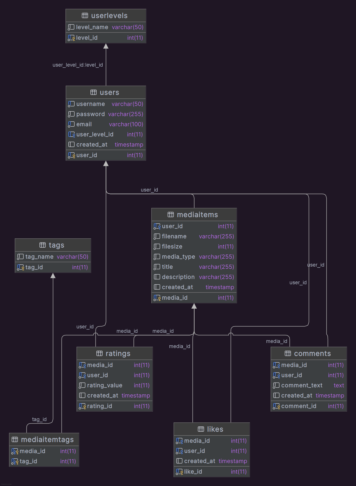

# Retrowave mediapostaussivusto

Retrowave sivustolla voi selata sekä myös jakaa/postata omia 80-luvun media aiheisia kuvia. Sivusto tarkoitettu pääasiallisesti henkilöille, jotka pitävät nostalgiasta ja 80-luvun mediasta.

## Toiminnallisuudet

-Kirjautumattoman käyttäjän rekisteröinti
-Kirjautumattoman käyttäjän sisäänkirjautuminen
-Kirjautuneen käyttäjän uloskirjautuminen
-Kirjautunut käyttäjä voi luoda omia posteja, jotka sisältävät otsikon, kuvauksen, tagit ja media tiedoston
-Kirjautunut käyttäjä voi tykätä posteista
-Kirjautunut käyttäjä voi kommentoida postauksia
-Kirjautunut käyttäjä voi muokata postaustaan
-Kirjautunut käyttäjä voi muokata profiilitietojaan
-Kirjautunut käyttäjä voi klikata tagia ja selata sen sisältämää mediaa
-Videoiden thumbnailit ei toimi

## Käyttöönotto

### 1. Backend

#### Paikallinen kehitys

1. Luo kanta
2. Luo käyttäjä, jolla on oikeudet kantaan
3. Asenna ja käynnistä backend-sovellukset:

```bash
# Kloonaa repo
git clone <repon URL>
# Siirry repon kansioon
cd hybridisovellukset-yksilotehtava-backend
# Asenna riippuvuudet, ja luo .env-tiedostot kaikkiin sovelluksiin
cd hybrid-types
npm run install

cd ../hybrid-auth-server
npm run install
cp .env.sample .env
nano .env

cd ../hybrid-media-api
npm run install
cp .env.sample .env
nano .env

cd ../hybrid-upload-server
npm run install
cp .env.sample .env
nano .env

# Käynnistä kehityspalvelin
cd ..
npm run dev
```

### 2. Frontend

#### Paikallinen kehitys

```bash
# Kloonaa repo
git clone <repon URL>
# Siirry repon kansioon
cd hybridisovellukset-yksilotehtava-frontend
# Asenna riippuvuudet
npm run install
# Luo sopiva .env-tiedosto
cp .env.sample .env
nano .env
# Käynnistä kehityspalvelin
npm run dev
```

#### Esimerkkiskripti frontendin rakennukseen palvelimella

Tämän voi ajaa SSH-yhteydellä kun koodi on päivittynyt.

```bash
cd ~/hybridisovellukset-yksilotehtava-frontend/ &&
       echo "Running 'git checkout main'" &&
       git checkout main &&
       echo "Running 'git pull'" &&
       git pull &&
       echo "Running 'npm install'" &&
       npm install &&
       echo "Running 'npm run build'" &&
       npm run build &&
       echo "Clearing the html directory" &&
       rm -rf /var/www/html/* &&
       echo "Moving frontend files to the html directory" &&
       cp -r dist/* /var/www/html/ &&
       echo "Done"
```

## Kuvakaappaukset

### Kirjautuminen


### Kirjautuneen etusivu


### Upload


### Postin napit


### Profiili


## Tietokantarakenne



## API-linkit

### auth-server

APIn osoite: https://retrowave-backend.norwayeast.cloudapp.azure.com/auth-server/api/v1

APIn dokumentaatio: https://retrowave-backend.norwayeast.cloudapp.azure.com/auth-server/

### media-api

APIn osoite: https://retrowave-backend.norwayeast.cloudapp.azure.com/media-api/api/v1

APIn dokumentaatio: https://retrowave-backend.norwayeast.cloudapp.azure.com/media-api/

### upload-server

APIn osoite: https://retrowave-backend.norwayeast.cloudapp.azure.com/upload-server/api/v1

APIn dokumentaatio: https://retrowave-backend.norwayeast.cloudapp.azure.com/upload-server/

## Bugit ja ongelmat

- useravatar ei toimi se on vain p tagi
- people u follow on vaa kosmeettine atm ei valmis
- search nappi ei toimi
- posteja ei voi poistaa vain muokata
- postien alla tagit eivät näy vaikka niillä on tagit
- postien napit eivät ole kaikki ikoneita ja jaa samaa lookkia like napin kanssa
- en ehtinyt siirtää likesien numeroa ikonin viereen
- etusivu jäi tyhjäksi en ehtinyt laittaa popular tms posteja hero imagen alle
- repost nappi ei toimi
- etusivulle jäi testivaiheen tervetuloa viesti anonyymille käyttäjälle
- kommentointi ei toimi oikein, yhden postin kommentti näkyy toisissakin posteissa
- webbipalvelin ei osaa reitittää oikein minnekkään muualle kuin etusivulle

## Tekoäly

Tagit lisättiin frontendiin tekoälyn avustuksella. Tekoälyä käytettiin myös muihin pieniin korjauksiin, joista mainitaan commit-viesteissä tai koodissa.

## Lähteet

Logo ja sivuston nimi täältä
https://www.textstudio.com/logo/retro-wave-font-1619
